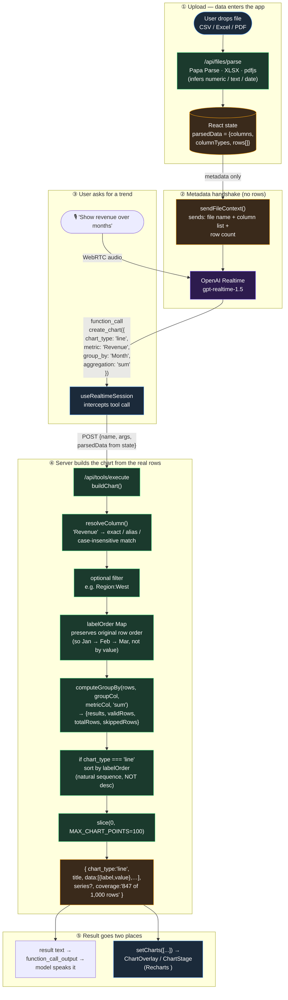

# Line Chart — How It's Generated & Where the Data Comes From

A line chart in this app is built in three stages: **upload** (data enters the system), **voice → tool call** (the model decides to chart), and **server build** (the backend aggregates rows into chart points). The model never touches the rows — it only names columns.

## Flow

## Where the data comes from — at each step

| Stage | Source | What it holds |
|---|---|---|
| ① Upload | User's uploaded file | Raw bytes, parsed into typed rows by [`/api/files/parse`](../src/app/api/files/parse/route.ts) |
| ② React state | `parsedData` in [page.tsx](../src/app/(app)/page.tsx) | The only live copy of the rows — lives in the browser |
| ③ Model input | [`sendFileContext`](../src/lib/useRealtimeSession.ts#L772) | **Column names + row count only** — no rows cross the wire to OpenAI |
| ④ Tool call body | [useRealtimeSession.ts:298-307](../src/lib/useRealtimeSession.ts#L298-L307) | React sends `parsedData` back to its own server route along with the model's args |
| ⑤ Aggregation | [`buildChart` in execute/route.ts:532](../src/app/api/tools/execute/route.ts#L532) | Groups rows by `Month`, sums `Revenue`, returns `{label, value}[]` |
| ⑥ Render | [ChartOverlay](../src/components/ChartOverlay.tsx) | Recharts `<LineChart>` reads the `data[]` — one point per group |

## Why line charts get special-cased

Bar charts sort descending by value (biggest bar first). Line charts must preserve the **original row order** so Jan → Feb → Mar reads chronologically, not Mar → Jan → Feb. That's what [`labelOrder`](../src/app/api/tools/execute/route.ts#L640-L644) does: it records each group's first appearance and forces a re-sort after aggregation ([execute/route.ts:679-683](../src/app/api/tools/execute/route.ts#L679-L683)).

## What the model never sees

- Raw rows
- Actual values
- Computed aggregates (until they come back as `result` text)

The model's job is to pick `chart_type`, `metric`, `group_by`, and `aggregation` by column name. Everything else is deterministic server code — which is why numbers in the chart always match numbers in the spoken answer.
